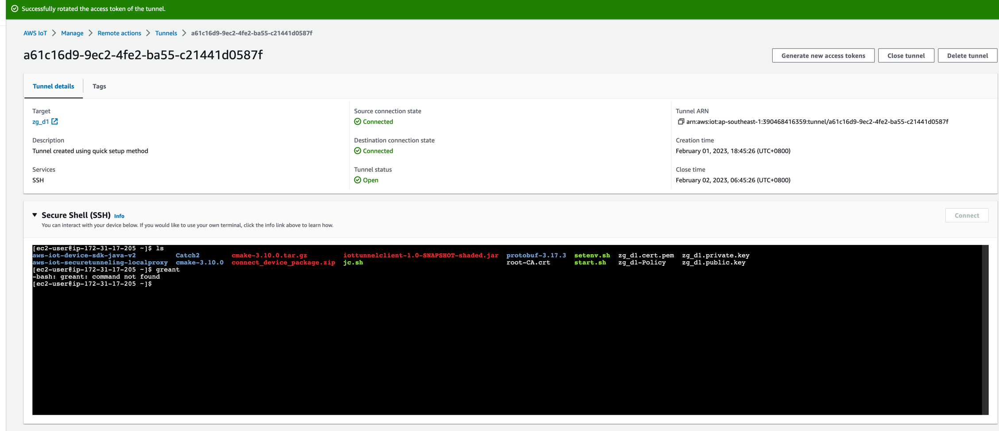

# AWS iot 隧道

本程序是帮助连接iot core并实时监听隧道开启的通知，打开Destination

>  _一定一定要关闭本机VPN以后再调试_


**几个关键概念**
1. 你需要一个IoT设备，本例子里面使用ec2代替
2. 这个设备需要注册到AWS IoT管理
3. 这个设备可以通过 [AWS IoT起步](https://docs.aws.amazon.com/zh_cn/iot/latest/developerguide/iot-quick-start.html) 验证是否正常连接区域的IoT服务
4. 在这个设备上安装localproxy https://github.com/aws-samples/aws-iot-securetunneling-localproxy (按照步骤一步一步编译安装)
5. 设备上的ssh服务已经开启的

使用之前， 请确保你已经执行完成了1，2，3，4的准备工作


## 本程序打包

```bash
mvn clean package
#java -jar target/iottunnelclient-1.0-SNAPSHOT-shaded.jar
```


## 复制程序上去

启动:
--endpoint a1cw44obfpxk2h-ats.iot.ap-southeast-1.amazonaws.com --client_id sdk-java --topic sdk/test/java --ca_file ../root-CA.crt --cert ../zg_d1.cert.pem --key ../zg_d1.private.key

```bash 
#scp -i ~/ec2keys/sig.pem target/iottunnelclient-1.0-SNAPSHOT-shaded.jar  ec2-user@54.169.129.200:/tmp
启动运行:
java -jar iottunnelclient-1.0-SNAPSHOT-shaded.jar  ats_endpoint thing_name access_key access_secret
```
## 等待Tunnel创建

运行本程序， 然后等待创建tunnel的程序发送指令过来并启动localproxy

```bash
ps -ef|grep localproxy
#可以看到类似输出
localproxy -t dest_token_generated_by_iot -r ap-southeast-1 -d localhost:22

```

## 连接

>>> 作为Source Connect, 你需要填入的不是source token, 而是正常登录你的目标设备的用户名和密码或者密钥， 比如对于我的ec2, 需要填入的就是ec2-user和xxx.pem



## 注意

> MQTT over websocket必须使用ak/sk或者sessionToken, 详情见 https://github.com/aws/aws-iot-device-sdk-java#sample-applications

```html

For an MQTT over WebSocket connection, provide these arguments:

    awsAccessKeyId: IAM access key ID
    awsSecretAccessKey: IAM secret access key
    sessionToken: (optional) if temporary credentials are used


```

## 错误分析

### 错误1： 5134: The connection was closed unexpectedly.
```bash
Connection interrupted: 5134: The connection was closed unexpectedly.
java.util.concurrent.ExecutionException: software.amazon.awssdk.crt.mqtt.MqttException: Old requests from the previous session are cancelled, and offline request will not be accept.
	at java.base/java.util.concurrent.CompletableFuture.reportGet(CompletableFuture.java:395)
	at java.base/java.util.concurrent.CompletableFuture.get(CompletableFuture.java:1999)
	at top.cuteworld.iotdemo.SSHTunnelTopicListener.run(SSHTunnelRunnable.java:33)
	at java.base/java.lang.Thread.run(Thread.java:834)
Caused by: software.amazon.awssdk.crt.mqtt.MqttException: Old requests from the previous session are cancelled, and offline request will not be accept.
Connection resumed: clean session
```
_分析： 这个错误的提示跟这个错误的根本原因没有更新, 需注意_ 


### 真实原因是： 
**订阅了一个未授权订阅的topic。** 
### 解决方案 
**更新授权证书关联的Policy, 将这个topic增加到订阅里面去**

```json
{
  "Version": "2012-10-17",
  "Statement": [
    {
      "Effect": "Allow",
      "Action": [
        "iot:Publish",
        "iot:Receive"
      ],
      "Resource": [
        "arn:aws:iot:ap-southeast-1:390468416359:topic/sdk/test/java",
        "arn:aws:iot:ap-southeast-1:390468416359:topic/sdk/test/python",
        "arn:aws:iot:ap-southeast-1:390468416359:topic/sdk/test/js",
        "arn:aws:iot:ap-southeast-1:390468416359:topic/$aws/things/zg_d1/tunnels/notify" // 这一行 必须授予这个主题订阅的权限
      ]
    },
    {
      "Effect": "Allow",
      "Action": "iot:Subscribe",
      "Resource": [
        "arn:aws:iot:ap-southeast-1:390468416359:topicfilter/sdk/test/java",
        "arn:aws:iot:ap-southeast-1:390468416359:topicfilter/sdk/test/python",
        "arn:aws:iot:ap-southeast-1:390468416359:topicfilter/sdk/test/js",
        "arn:aws:iot:ap-southeast-1:390468416359:topicfilter/$aws/things/zg_d1/tunnels/notify" // 这一行 必须授予这个主题订阅的权限
      ]
    },
    {
      "Effect": "Allow",
      "Action": "iot:Connect",
      "Resource": [
        "arn:aws:iot:ap-southeast-1:390468416359:client/sdk-java",
        "arn:aws:iot:ap-southeast-1:390468416359:client/basicPubSub",
        "arn:aws:iot:ap-southeast-1:390468416359:client/sdk-nodejs-*",
        "arn:aws:iot:ap-southeast-1:390468416359:client/pi-*"
      ]
    }
  ]
}


```

## 树莓派编译localproxy

### 通过 ./docker-build.sh 编译

```bash
./docker-build.sh (指定arm64架构， 只要arm64)
编译出来镜像： /home/aws-iot-securetunneling-localproxy


```

### 树莓PI 安装docker
```bash
sudo curl -sSL https://get.docker.com | sh
sudo groupadd docker
sudo usermod -aG docker amazon
sudo systemctl restart docker
#这句话很重要的
newgrp docker

```

```bash
#cmake 
sudo apt install -y cmake
#zlibc
sudo apt install zlibc

#boost
wget https://boostorg.jfrog.io/artifactory/main/release/1.81.0/source/boost_1_81_0.tar.gz -O /tmp/boost.tar.gz
tar xzvf /tmp/boost.tar.gz
cd boost_1_81_0
./bootstrap.sh
sudo ./b2 install link=static

# libssl-dev
sudo apt install libssl-dev

# Catch2
git clone --branch v2.13.6 https://github.com/catchorg/Catch2.git
cd Catch2
mkdir build
cd build
cmake ../
make
sudo make install

# Protobuf
wget https://github.com/protocolbuffers/protobuf/releases/download/v3.17.3/protobuf-all-3.17.3.tar.gz -O /tmp/protobuf-all-3.17.3.tar.gz
tar xzvf /tmp/protobuf-all-3.17.3.tar.gz
cd protobuf-3.17.3
mkdir build
cd build
cmake ../cmake
make
sudo make install


#  最终最终 localproxy
git clone https://github.com/aws-samples/aws-iot-securetunneling-localproxy
cd aws-iot-securetunneling-localproxy
mkdir build
cd build
#注意加上-DCMAKE_SHARED_LINKER_FLAGS='-latomic'， 以避免 || undefined reference to '__atomic_fetch_add_8' || 错误
cmake -DCMAKE_SHARED_LINKER_FLAGS='-latomic' ../  
make -j4
```

### 编译错误

```bash
/usr/bin/ld: /usr/local/lib/arm-linux-gnueabihf/libprotobuf-lite.a(arena.cc.o): in function `google::protobuf::internal::ThreadSafeArena::Init(bool)':
arena.cc:(.text+0xa60): undefined reference to `__atomic_fetch_add_8'

```
>解决: cmake的时候， 加上 cmake _-DCMAKE_SHARED_LINKER_FLAGS='-latomic'_ ../

## 其他参考
[安装cmake 3.10](https://www.matbra.com/2017/12/07/install-cmake-on-aws-linux.html)
[IoT Core常用的topic名称](https://docs.aws.amazon.com/iot/latest/developerguide/reserved-topics.html#reserved-topics-secure)
[Iot Java SDK](https://docs.aws.amazon.com/iot/latest/developerguide/iot-sdks.html)
[预留的主题](https://docs.aws.amazon.com/zh_cn/iot/latest/developerguide/reserved-topics.html#reserved-topics-secure)